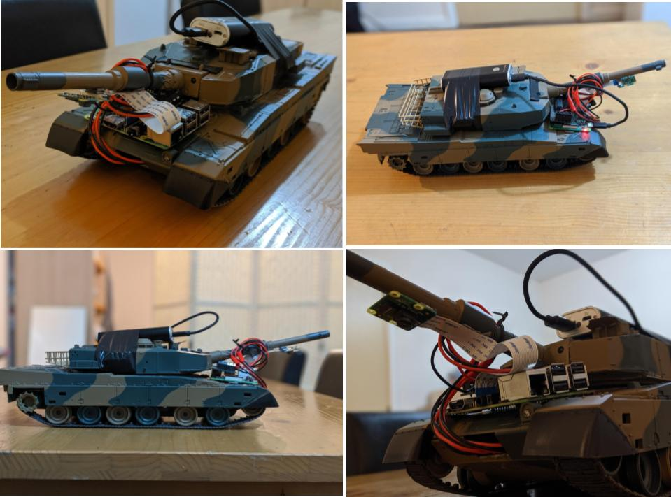

# RPi Tank

Coding of the control system for a model tank with **Raspberry Pi**. 
The project is divide into 4 sections:

> 1. __Keyboard Controlled RPi tank with _Remote Desktop Connection_ into the Raspberry Pi.__
> 2. __Keyboard Controlled RPi tank with _Network Sockets_.__
> 3. __RPi Tank video streaming via _Network Sockets_ and _http_.__
> 4. __Line following RPi tank using **OpenCV**.__

## LineFollowing in ACTION!🤖:joystick:

Add additional notes about how to deploy this on a live system

## Getting Started

These instructions will get you a copy of the project up and running on your local machine for development and testing purposes. See deployment for notes on how to deploy the project on a live system.

### Prerequisites

What things you'll need in terms of Software and Hardware and how to install them:

### Harware required

- ***1. Raspberry Pi (Model 3 onwards recommended)***	
- ***2. MotoZero PCB***
- ***3. Power Supply (5V Power Bank)***
- ***4. Pi Camera Module V2***

### Libraries

The list of libraries that are required are stated below:

```
1. GPIOZERO Library - A simple interface to GPIO devices with Raspberry Pi.

  pip install gpiozero
  
2. Pynput Library - Keyboard event handling Library for Tank's controls.
  
  pip install pynput
  
3. Pi Camera - This package provides a pure Python interface to the Raspberry Pi camera module for Python 2.7 (or above) or Python 3.2 (or above).  

  pip install picamera
  
4. OpenCV - Unofficial pre-built OpenCV packages for Python.

  pip install opencv-python
```

And repeat

```
until finished
```

End with an example of getting some data out of the system or using it for a little demo

## Running the RPi Tank:

***The final setup of the RPi tank looks something like*** :arrow_double_down:



### :arrow_forward: Executing Programmes associated.

_Follow the script execution cycle below:_
```
1. 
```

## Built With

* [Raspbian](https://www.raspberrypi.org/downloads/raspbian/) - OS for Raspberry Pi
* [Python](https://www.python.org/) - Primary Programming Language.
* [PyCharm](https://www.jetbrains.com/pycharm/) - The IDE used for Develpment and the _Recommended._

## License

This project is licensed under the MIT License - see the [LICENSE.md](LICENSE.md) file for details

## Acknowledgments

* Hat tip to anyone whose code was used
* Inspiration
* etc
